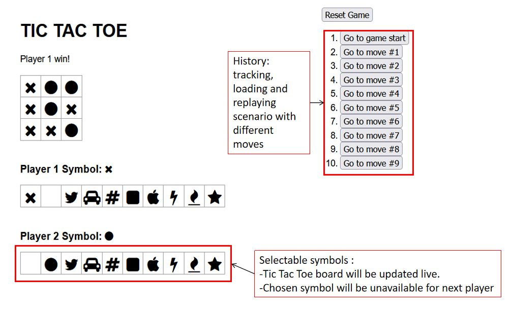
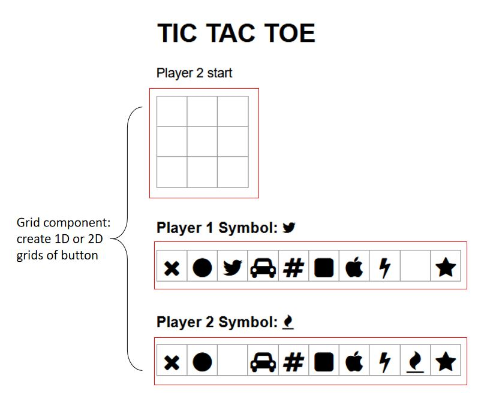
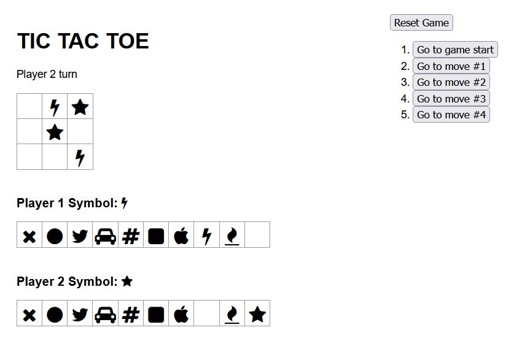

Credits:
This project was bootstrapped with [Create React App](https://github.com/facebook/create-react-app).
This project was based off the tutorial from https://reactjs.org/tutorial/tutorial.html with additions as well as modifications.

## Available Scripts
To view the project, you can run:
### `npm install`
to get the appropriate node_modules. 

Then run:
### `npm start`

Runs the app in the development mode.\
Open [http://localhost:3000](http://localhost:3000) to view it in the browser.

Additional features added that were not in the tutorial:
-Selectable symbols for each player with live symbol updates on the TIC-TAC-TOE board
-Reset game function
-Starting player is selected at random

Functional differences from tutorial:
-TIC-TAC-TOE board is a 2D grid instead of a 1D grid
-'Grid' component is used to make both the 1D row of buttons for symbol selection and the 2D grid of buttons for the board

Try it out and have fun!

